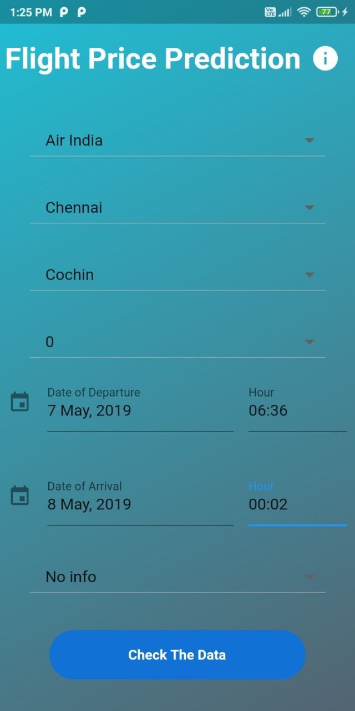

# Flight Price Prediction

End To end machine learning preoject where we are provided with prices of flight tickets for various airlines between the months of March and June of 2019 and between various cities. 

## Components used

- Flutter
- Heroku
- Flask
- Postman(to verify the API)

## Dataset

Data :- https://machinehack.com/hackathons/predict_the_flight_ticket_price_hackathon/data

## Screens

